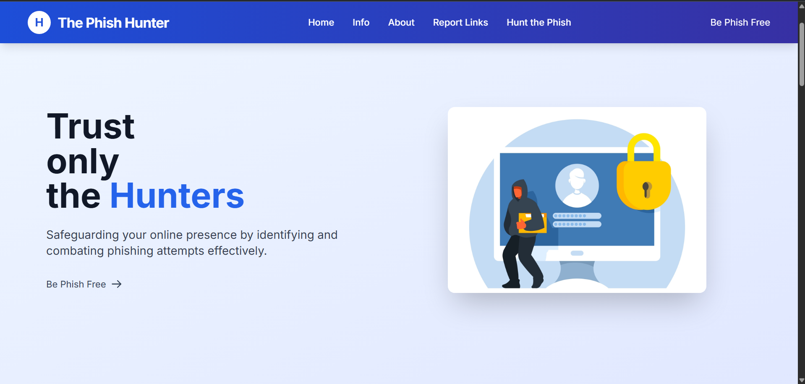
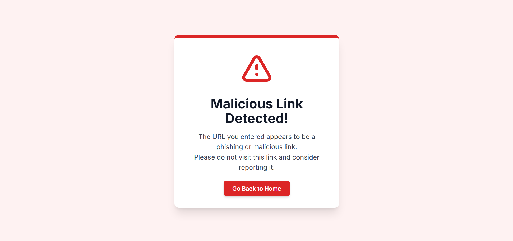
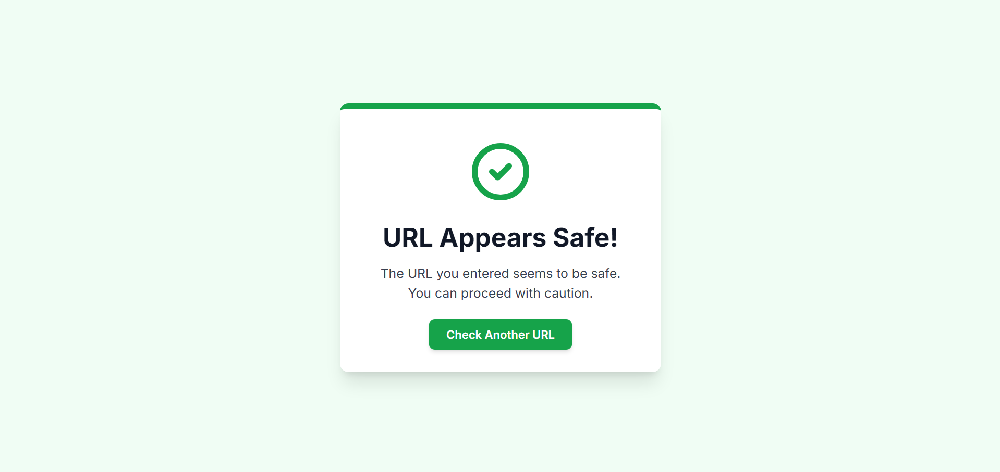

🎣 Phish Website: Your Guardian Against Phishing Attacks
 is an intuitive web application designed to empower users in identifying and avoiding malicious phishing websites. Leveraging the power of Machine Learning, specifically the Naive Bayes algorithm, it provides quick and reliable predictions on the legitimacy of a given URL.

🚀 Table of Contents
Introduction

Features

How It Works

Demo/Screenshots

Installation

Prerequisites

Cloning the Repository

Setting up the Virtual Environment

Installing Dependencies

Running the Application

Usage

Project Structure

Technologies

Contributing

License

Acknowledgements

💡 Introduction
In today's digital landscape, phishing attacks remain a persistent and evolving threat, aiming to steal sensitive information through deceptive websites. Phish website addresses this critical security challenge by providing a proactive defense mechanism. This web application offers a simple yet powerful tool for users to input any suspicious URL and receive an instant classification of whether it's likely a phishing site or a legitimate one.

Our system is built upon a Naive Bayes classifier, meticulously trained on a diverse dataset of known legitimate and fraudulent URLs, ensuring a robust and data-driven prediction capability.

✨ Features
🌐 Web-based Interface: Easy accessibility from any device with a web browser, requiring no local software installation beyond the server.

🤖 ML-Powered Classification: Utilizes the Naive Bayes machine learning algorithm for efficient and accurate phishing detection.

🖱️ User-Friendly UI: A clean, responsive interface (built with Tailwind CSS) for straightforward URL input and clear display of prediction results.

⚡ Quick & Efficient Detection: Provides near real-time analysis to enhance your online security without significant delay.

✅ Reliable & Accurate Results: Predictions are based on a comprehensively trained machine learning model, aiming for high reliability.

⚙️ How It Works
URL Input: The user enters a suspicious URL into the web application's input field.

Preprocessing: The Flask backend receives the URL and preprocesses it (e.g., lowercase conversion, protocol removal, tokenization) to prepare it for the ML model.

Vectorization: The preprocessed URL is transformed into a numerical feature vector using a pre-trained CountVectorizer.

Prediction: The feature vector is then fed into the loaded Naive Bayes classification model.

Result Display: Based on the model's prediction (malicious or safe), the web application renders an appropriate result page to the user.

📸 Demo/Screenshots

Homepage Screenshot: 
Malacious Screenshot: 
Safe Screenshot: 

💻 Installation
To get the Phish website up and running locally, follow these steps:

Prerequisites
Python 3.8+

pip (Python package installer)

Cloning the Repository
First, clone the project repository to your local machine:

git clone [https://github.com/pranshul30/Phising-website/]
cd phishing-website

Setting up the Virtual Environment
It's highly recommended to use a virtual environment to manage project dependencies:

python -m venv venv
# On Windows:
venv\Scripts\activate
# On macOS/Linux:
source venv/bin/activate

Installing Dependencies
Once your virtual environment is active, install the required Python packages using the requirements.txt file.

Important: Ensure your requirements.txt specifies the scikit-learn version 1.2.1 to match the version used for training and pickling your models (PhishingProtector.pkl and vector.pkl). Mismatched versions can lead to warnings or incorrect predictions.

Create/Verify your requirements.txt contains:

Flask==2.3.2
pandas==2.0.3
scikit-learn==1.2.1
markupsafe==2.1.3

Then, install:

pip install -r requirements.txt

Model Files
Ensure you have your trained model files (PhishingProtector.pkl and vector.pkl) placed in the root directory of your project (the same directory as app.py). These are essential for the application's functionality.

Running the Application
After all dependencies are installed and model files are in place, you can run the Flask application:

python app.py

The application will start, and you should see output similar to this:

 * Serving Flask app 'app'
 * Debug mode: on
WARNING: This is a development server. Do not use it in a production deployment.
 * Running on http://127.0.0.1:5000
Press CTRL+C to quit

Open your web browser and navigate to http://127.0.0.1:5000/ to access the Phish website.

📖 Usage
Open the Phish  website in your web browser (e.g., http://127.0.0.1:5000/).

Scroll down to the "Hunt the Phish" section (or use the navigation menu).

Enter the URL you want to check for phishing in the designated input field.

Click on the "Check Link" button.

The Naive Bayes algorithm will process the URL, and the result (indicating whether the URL is likely "Malicious" or "Safe") will be displayed on a new page.

Note: The accuracy of the prediction is directly dependent on the quality and comprehensiveness of the dataset used to train the ML model. Continuous improvement can be achieved by training on larger and more diverse datasets.

📂 Project Structure
Phish-website/
|--URL.csv                     #Dataset for scam urls
├── app.py                     # Flask application backend
├── requirements.txt           # Python dependencies
├── PhishingProtector.pkl      # Trained ML model (Naive Bayes)
├── vector.pkl                 # Trained URL vectorizer (CountVectorizer)
├── templates/
│   ├── index.html             # Main landing page
│   ├── Malicious.html         # Page displayed for detected phishing URLs
│   └── Safe.html              # Page displayed for safe URLs
└── venv/                      # Python virtual environment (ignored by Git)

🛠️ Technologies
The Phish project is built using a combination of frontend and backend technologies:

Frontend:

HTML5: For structuring the web pages.

CSS3 (with Tailwind CSS): For modern, responsive, and visually appealing styling.

JavaScript: For interactive elements and potential client-side validations (though primarily a backend-driven app for now).

Backend:

Python: The core programming language.

Flask: A lightweight web framework for building the web application.

Pandas: Used for data manipulation, especially when preprocessing URLs into DataFrames.

Scikit-learn: A robust machine learning library, used for:

MultinomialNB: The Naive Bayes classification model.

CountVectorizer: For transforming text (URLs) into numerical feature vectors.

👋 Contributing
Contributions to Phish website are warmly welcomed! If you encounter any bugs, have suggestions for new features, or want to improve the codebase, please feel free to:

Fork the repository.

Create a new branch (git checkout -b feature/AmazingFeature).

Make your changes and commit them (git commit -m 'Add some AmazingFeature').

Push to the branch (git push origin feature/AmazingFeature).

Open a Pull Request.

Please ensure your code adheres to good practices and includes appropriate tests if applicable.

📄 License
This project is open-source and licensed under the MIT License. See the LICENSE file in the repository for more details.

🙏 Acknowledgements
My mentor/instructors for guidance.

The open-source community for the invaluable tools and libraries used in this project.

The creators of the dataset used for training 